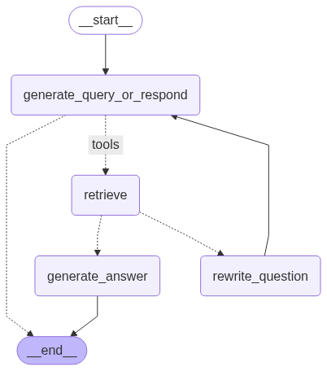
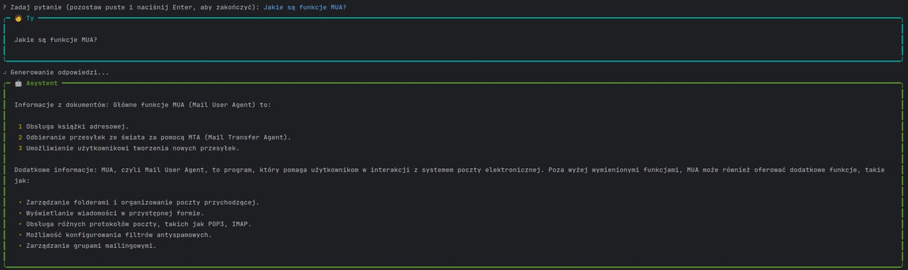
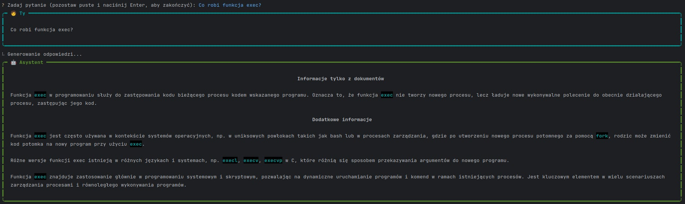

# Asystent nauki do kolokwium – Dokumentacja

## Opis ogólny

Aplikacja CLI wspomagająca studentów w pracy z dokumentami. Pozwala zarządzać projektami, wczytywać dokumenty (lokalne i online), zadawać pytania na podstawie treści dokumentów oraz zarządzać historią czatu. Dane przechowywane są w lokalnej bazie SQLite. Aplikacja używa RAG (Retrieval-Augmented Generation) z LangChainem.

---

## Wymagania

- Python 3.10+

- uv – szybki manager środowisk i zależności (alternatywa dla pip + virtualenv)

- just – narzędzie do prostego uruchamiania komend

---

## Instrukcja uruchomienia

```bash
git clone https://github.com/afilewicz/RAG-LLM.git
cd LLM-projekt
uv venv
source .venv/bin/activate
uv sync
just
```
---

##  Struktura głównych komponentów

### CLI – Interfejs użytkownika (tekstowy)

Z wykorzystaniem **InquirerPy** realizowane są:

- Wybór projektu (istniejącego lub nowego),
- Wybór opcji: ładowanie/przeglądanie dokumentów, zadawanie pytań, czyszczenie historii, usuwanie/zamiana projektu,
- Potwierdzenia akcji (usuwanie projektów/dokumentów),
- Interaktywne wprowadzanie pytań.

## Przechowywanie danych

### SQLite przechowuje metadane:

- Projekty,
- Dokumenty przypisane do projektów.

### Chroma (wektorowa baza danych) przechowuje:

- Przetworzoną zawartość dokumentów (embeddingi),

- Używana przy zadawaniu pytań i ocenie trafności odpowiedzi.


Używana baza danych **SQLite** zawiera dwie tabele:

```sql
CREATE TABLE IF NOT EXISTS projects (
    id INTEGER PRIMARY KEY AUTOINCREMENT,
    name TEXT NOT NULL UNIQUE
    );

CREATE TABLE IF NOT EXISTS documents (
    id INTEGER PRIMARY KEY AUTOINCREMENT,
    name TEXT NOT NULL,
    project_id INTEGER NOT NULL,
    FOREIGN KEY (project_id) REFERENCES projects(id)
);
```


---

## Praca z dokumentami

### Wczytywanie


- 📄 Pliki `.pdf` z katalogu `data/`
- 🌐 Strony internetowe (URL)

  Dokumenty są dzielone na fragmenty, następnie embeddingi przekazywane są do **wektorowej bazy wiedzy (VectorStore)**.

### Przeglądanie i usuwanie

  Użytkownik może:

- Przeglądać listę dokumentów w projekcie,
- Wybierać i usuwać wybrane pliki.

---

## Zadawanie pytań

- Każde pytanie jest przetwarzane w pętli,
- Do historii wiadomości dodawany jest `SystemMessage`,
- Model generuje odpowiedź w oparciu o dokumenty i opcjonalnie uzupełnia brakującą wiedzę,
- Historia konwersacji jest przechowywana i może być czyszczona.

---

## Konsola – Wyświetlanie wyników

Z użyciem **rich.console**, **rich.panel** i **rich.markdown**, aplikacja:

- Renderuje wiadomości użytkownika i asystenta w stylizowanych panelach,
- Pokazuje historię czatu,
- Informuje o stanie operacji (np. spinner przy ładowaniu danych).

---

## Możliwości

- Tworzenie i usuwanie projektów,
- Dodawanie i usuwanie dokumentów z projektu,
- Pobieranie listy projektów i dokumentów,
- Pobieranie ID projektu po nazwie.

---

## Schemat architektury systemu




---

## Komponenty systemowe

### `Project`

Reprezentuje pojedynczy projekt:

- Atrybuty: `id`, `name`, `vector_store`, `loaded_docs`
- Obsługuje dodawanie dokumentów do wektorowej bazy danych

### `ProjectDB`

Warstwa pośrednicząca do bazy SQLite:

- Zarządza projektami i dokumentami
- Inicjalizuje tabele w bazie

### `history_manager`

Zarządza historią czatu użytkownika na poziomie projektu (identyfikowanego przez `thread_id`).

### `graph.invoke(...)`

Główna funkcja generująca odpowiedzi – wykorzystuje pipeline LangChaina i konfigurację RAG.

---

## Node'y w pipeline (graph.invoke(...))

### generate_query_or_respond

To pierwszy krok w grafie – decyduje, czy zadać zapytanie (retreive, web_search) czy wygenerować odpowiedź. 
Używa narzędzi (tools) do wywołania RAG lub web search. 
Wykorzystuje llm.bind_tools([retreive, web_search]).

### grade_documents

Sprawdza, czy ostatnio dodane wiadomości dostarczają wystarczającego kontekstu.
Używa GRADE_PROMPT oraz llm.with_structured_output(GradeDocuments) do zwrotu "tak" lub "nie".
Zwraca przejście do "generate_answer" lub "rewrite_question".

### rewrite_question

Jeśli kontekst jest nieadekwatny, przepytuje LLM o lepszą wersję pytania (REWRITE_PROMPT).
Zastępuje ostatnią wiadomość użytkownika nowym pytaniem.

### generate_answer

Końcowy etap. Zbiera ostatnie wiadomości i tworzy prompt na bazie SYSTEM_PROMPT.
Generuje końcową odpowiedź od asystenta.

---

## Narzędzia (tools)

To narzędzia, które LLM może wywołać podczas interakcji:

- retreive(query, config) - szuka dokumentów wektorowych (ChromaDB) podobnych do pytania. Zwraca listę obiektów
Document (tekst + metadane). Wymaga vector_store w konfiguracji.

- web_search(query) - pobiera informacje z internetu na bazie zapytania (WebBaseLoader).

---

## Prompt Engineering

### `SYSTEM_PROMPT` & `SYSTEM_MESSAGE`

Określają zachowanie asystenta – odpowiedzi mają dwie sekcje:

- **Informacje z dokumentów**
- **Dodatkowe informacje**, jeśli potrzebne

### `GRADE_PROMPT`

Służy ocenie trafności dokumentu względem pytania – wynik to **tak** lub **nie**.

### `REWRITE_PROMPT`

Przeformułowuje pytanie użytkownika dla lepszego zrozumienia intencji.

---

## Konfiguracja i ścieżki

Konfiguracja `settings` zawiera m.in.:

- Ścieżkę do bazy danych: `DB_PATH`
- Ścieżkę do katalogu z dokumentami: `DATA_DIR_PATH`

---

## Przykładowe zapytania


---